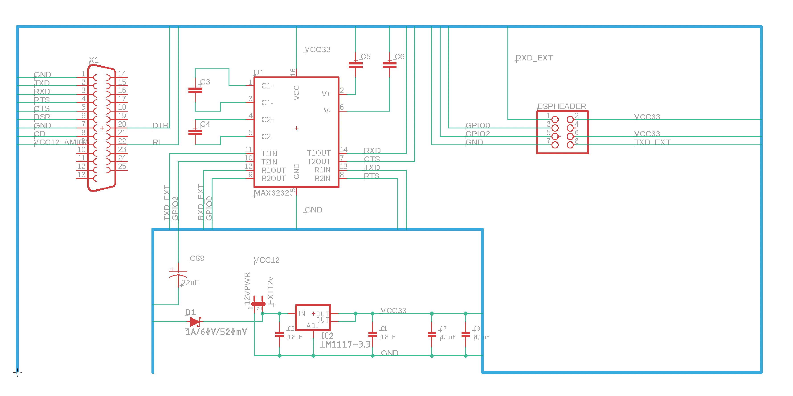
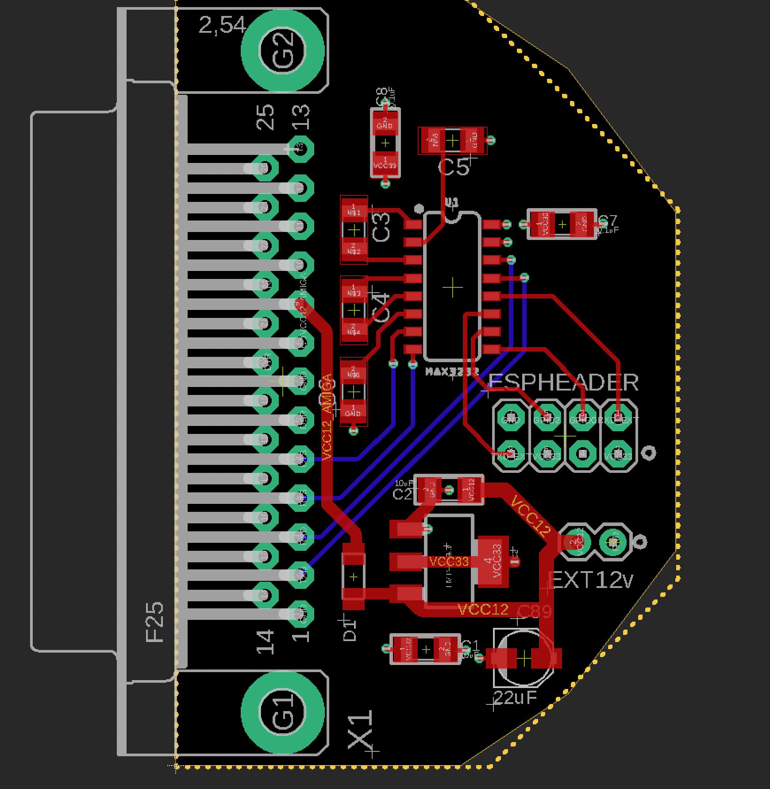

# espthing - GPL v2

THIS DESIGN IS PROVIDED BY THE COPYRIGHT HOLDERS AND CONTRIBUTORS "AS IS" AND ANY EXPRESS OR IMPLIED WARRANTIES, INCLUDING, BUT NOT LIMITED TO, THE IMPLIED WARRANTIES OF MERCHANTABILITY AND FITNESS FOR A PARTICULAR PURPOSE ARE DISCLAIMED. IT WILL PROBABLY BLOW YOUR COMPUTER AND HOUSE UP. 

A stupid ESP thing i made for Erik Hemming. Completely Untested.

Its an Amiga Serial Port to ESP01 breakout with the potential to power from the amiga serial port.

The Amiga Serial port says it can do 20mA at 12V. Which is likely sufficent to power the ESP01 and the MAX3232 @ 3.3v. In the event its not sufficient there is a breakout for the power supply and an optional diode is there to protect the Amiga.

In reality i would bet the 12v line can do better than 20mA.

# BOM

| Qty | Value                                | Device                               | Package     | Parts          | Description                          |
| --- | ------------------------------------ | ------------------------------------ | ----------- | -------------- | ------------------------------------ |
| 1   |                                      | DB25_FEMALEHP                        | F25HP       | X1             | 25 Pin Female Connector.             |
| 1   |                                      | PINHD-2X4                            | 2X04        | ESPHEADER      | 2 x 4 PIN HEADER                     |
| 2   | 0.1uF                                | CAP_CERAMIC1206                      | 1206        | C7, C8         | Ceramic Capacitors                   |
| 2   | 10uF                                 | CAP_CERAMIC1206                      | 1206        | C1, C2         | Ceramic Capacitors                   |
| 4   | 1uF                                  | C-EUC1206                            | 1206        | C3, C4, C5, C6 | 50V Capacitory                       |
| 1   | 22uF                                 | CPOL-USB                             | PANASONIC_B | C89            | POLARIZED CAPACITOR, American symbol |
| 1   | EXT12v                               | JUMPER-2PTH                          | 1X02        | 12VPWR         | Jumper                               |
| 1   | LM1117-3.3                           | V_REG_LM1117SOT223                   | SOT223      | IC2            | Voltage Regulator LM1117             |
| 1   | MAX3232                              | MAX2323SOIC16                        | SO16        | U1             | RS232 Transceiver                    |
| 1   | SMD-DIODE-SWITCHING-75V-150MA(D1206) | SMD-DIODE-SWITCHING-75V-150MA(D1206) | LED-1206    | D1             | 304040005                            |
